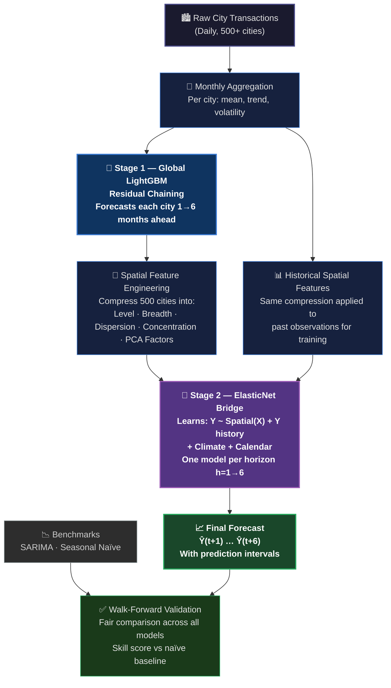

# Demand Forecasting Strategy
## Executive Overview

---

## The Business Problem

We need to forecast a key monthly indicator **six months into the future** — reliably enough to support operational and strategic decisions.

The challenge is not a lack of data. We have an abundance of it: transaction-level activity across **hundreds of cities**, updated daily. The challenge is that our target metric has only **96 monthly observations** — eight years of history — while the signals that drive it live in a much richer, faster-moving dataset.

The question is: **how do we responsibly connect what we know today to what will happen six months from now?**

---

## Why Standard Approaches Fall Short

The most common off-the-shelf forecasting tool — **Prophet**, developed by Meta — is designed to model a single series over time. It looks at the history of the target metric itself and extrapolates it forward, accounting for trends and seasonal patterns.

This is a reasonable starting point. But it leaves significant value on the table:

| Limitation | Consequence |
|---|---|
| Uses only the target's own history | Ignores hundreds of leading indicators available daily |
| Assumes the future looks like the past | Cannot adapt when external conditions shift |
| Treats all time equally | Misses the fact that some signals predict the future better than others |
| Produces a single line forecast | Gives no honest account of uncertainty |

In short, Prophet answers: *"Based on what Y looked like before, what will Y look like next?"*

We want to answer a harder and more valuable question: *"Based on what is happening across the entire system today, what will Y look like in six months?"*

---

## Our Approach: Two-Stage Transfer Forecasting

Rather than ignoring the rich city-level data we have, our strategy puts it at the centre of the forecast. The approach works in two stages that mirror how economic signals actually work in practice.

```
The core intuition:

  What happens in cities today
        →  tells us something about
              what the target will do in 6 months
```

This is not a new idea in economics. Central banks use exactly this logic when they monitor hundreds of leading indicators to forecast GDP. Our architecture formalises it for our specific data.

---

## The Modelling Pipeline



---

## Stage 1 — Understanding the City Signals

**What it does:** Takes daily transaction data across all cities and learns to forecast where each city will be one to six months from now.

**Why it matters:** Our target metric is monthly and slow-moving. But the city-level data that drives it is daily and information-rich. Stage 1 extracts that forward-looking signal before we ever touch the target metric. By the time we ask *"what will Y do?"*, we already have a well-informed view of where the underlying drivers are heading.

**How it works:** A single machine learning model — trained simultaneously across all cities — learns the shared patterns of city behaviour: seasonality, momentum, trend reversals. It does not treat each city as an isolated problem. It learns that what happens in one type of city tends to precede what happens in others. It then forecasts each city forward six months in a chain, where each step informs the next, ensuring the path is coherent rather than a series of disconnected guesses.

**What it produces:** A six-month forecast for every city — and, crucially, a compressed summary of the *spatial picture*: Are most cities growing or contracting? Is activity concentrated in a few places or broadly distributed? Is the system accelerating or decelerating? These become the inputs to Stage 2.

---

## Stage 2 — Connecting City Signals to the Target

**What it does:** Learns the historical relationship between the spatial picture of city activity and the target metric — then applies that relationship to the Stage 1 forecasts.

**Why it matters:** Not all of the 500+ city signals are equally relevant to the target. Some lead it by months. Others are noise. Stage 2 uses a regularised statistical model — one that automatically discards irrelevant signals — to identify which aspects of city activity genuinely drive the target forward.

**How it works:** For each of the six forecast horizons, a separate model is trained on the question: *"When city activity looked like this in the past, what did the target do h months later?"* The model combines the spatial city signals with the target's own recent history, seasonal patterns, and any known future factors such as climate forecasts or calendar events.

**What it produces:** A six-month forecast path for the target, with honest prediction intervals that reflect both the uncertainty in Stage 1's city forecasts and the uncertainty in the Stage 2 relationship itself.

---

## Why Two Stages Instead of One

A natural question is: why not build a single model that goes directly from city transactions to the target forecast?

The two-stage design is deliberate and addresses a real problem:

> At forecast time, we do not know what the cities will look like in month five or six. We only know where they are today.

A single model trained on current city data to predict Y six months ahead would work — and it is one of the approaches we evaluated. But it throws away a significant advantage: we can forecast the cities themselves with high accuracy, because they have abundant daily data and clear seasonal patterns. Stage 1 converts that data abundance into a six-month city outlook. Stage 2 then uses that outlook — not just today's snapshot — to forecast the target.

This mirrors exactly how professional economic forecasting works: first, build reliable short-term models for leading indicators; second, translate those leading indicators into the variable of interest.

---

## Benchmarks and Validation

Every forecast produced by this system is evaluated against two baselines:

**Seasonal Naïve** — the simplest possible forecast: the target in six months will look like it did six months ago, in the same season. Any model that cannot beat this is not adding value.

**SARIMA** — a classical statistical model that uses only the target's own history to forecast. If our two-stage approach does not outperform SARIMA, it means the city signals are not adding information beyond what the target's own momentum already tells us.

Validation is conducted using **walk-forward testing** — the only fair way to evaluate a time series forecast. We simulate standing at each point in history, training only on data available at that moment, and measuring forecast accuracy against what actually happened. This prevents the common mistake of a model appearing to work because it was tested on data it had already seen.

---

## What Makes This Better Than Prophet

| Dimension | Prophet | Two-Stage Transfer |
|---|---|---|
| **Data used** | Target history only | 500+ city signals + target history |
| **Forecast horizon** | Any, but degrades quickly | Optimised per horizon h=1→6 |
| **External signals** | Added linearly, no lag structure | Full leading indicator architecture |
| **Uncertainty** | Simplified confidence bands | Bootstrap intervals from both stages |
| **Validation** | Often in-sample | Strict walk-forward out-of-sample |
| **Path coherence** | Single extrapolation | Residual-chained, coherent path |
| **Adaptability** | Slow to adapt to regime change | City signals provide early warning |
| **Transparency** | Black box trend decomposition | Feature importance per horizon |

The fundamental difference is architectural. Prophet extrapolates. Our system *listens* to what the leading indicators are saying and translates that into a forward view of the target. When conditions are changing — which is precisely when accurate forecasting matters most — that difference is significant.

---

## Summary

The Two-Stage Transfer Forecasting system is built on a simple but powerful idea: **the cities know first**. By learning to forecast city-level activity in Stage 1 and then translating that into a target forecast in Stage 2, we convert an abundance of daily transactional data into a reliable six-month outlook — validated rigorously against historical reality and benchmarked honestly against simpler alternatives.

The result is not just a more accurate forecast. It is a more *honest* one: a forecast that knows what it does not know, and says so through its prediction intervals.

---

*Document prepared for strategic review. Technical implementation details available separately.*
